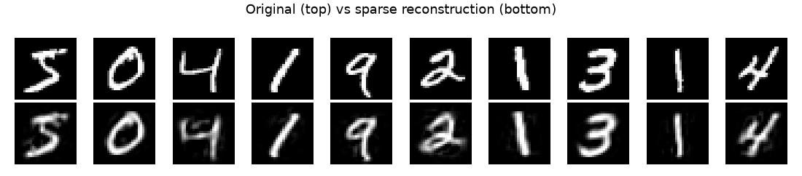
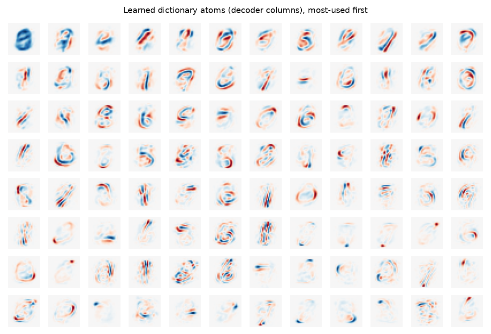
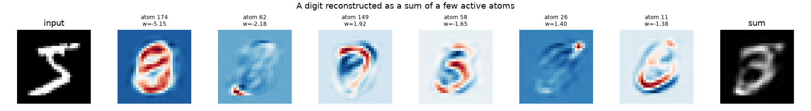

A First Example: Seeing What an SAE Learns
==========================================

The quickest way to build intuition for a top-k sparse autoencoder is to train
one on **images** and look at the result, because every learned feature can be
drawn as a picture. This example uses MNIST, the classic handwritten-digit
images (28×28 grayscale, available through the ``datasets`` library), but nothing
here is digit-specific: any dense matrix works the same way.

Everything below uses only the high-level public API
(:class:`~compresso.TopKSAEConfig`, :class:`~compresso.TopKSAETrainer`).

.. note::

   This page is illustrative; you do not need to run it to use Compresso. The
   figures are regenerated by ``docs/gen_figures.py`` (see that script for the
   extra plotting/data dependencies).

Treat each image as a dense vector
----------------------------------

We flatten every 28×28 image into a length-784 vector and scale it to ``[0, 1]``.
That gives a dense matrix ``X`` of shape ``(n, 784)`` — exactly the input format
the trainer expects.

.. code-block:: python

   import numpy as np
   from datasets import load_dataset

   ds = load_dataset("ylecun/mnist", split="train")
   imgs = np.stack([np.asarray(im, dtype=np.float32) for im in ds["image"][:20_000]]) / 255.0
   X = imgs.reshape(len(imgs), -1)   # (20000, 784) dense embeddings

Train a top-k SAE
-----------------

We use a mildly overcomplete code (``hidden_dim=196`` features) and keep only
``k=20`` of them active per image:

.. code-block:: python

   from compresso import TopKSAEConfig, TopKSAETrainer

   trainer = TopKSAETrainer(
       TopKSAEConfig(
           hidden_dim=196,
           k=20,
           batch_size=512,
           epochs=60,
           lr=1e-3,
           decay=True,
           seed=0,
       )
   ).fit(X)

Reconstruction quality climbs quickly. With only 20 active features the
reconstructions are recognizably the original digits:

The decoder *is* a dictionary
-----------------------------

The interesting part is **what** the model learned. The decoder maps each of the
196 code features back to image space, so every column of the decoder weight is
itself a 28×28 image — a *dictionary atom*. ``TopKSAE`` exposes this matrix
directly:

.. code-block:: python

   W = trainer.sae.get_decoder_weight().detach()   # (784, 196): each column is an atom

Plotted as images (most-used first), the atoms are clearly stroke- and
template-like: loops, diagonals, and digit fragments that combine to form
glyphs.

A code is a recipe
------------------

Because the decoder is linear, the reconstruction of any image is just the
**weighted sum of its few active atoms**. We can read a single image's sparse
code, then watch the picture assemble atom by atom:

.. code-block:: python

   code = trainer.encode(X[:1]).numpy()[0]      # (196,), only 20 non-zero
   active = np.nonzero(code)[0]                  # which atoms fired
   contributions = W.numpy()[:, active] * code[active]   # (784, 20) pieces
   reconstruction = contributions.sum(axis=1)   # == trainer.reconstruct(X[:1])

This is the whole idea in one picture: a dense image becomes a short, signed
recipe over a shared dictionary. Each ingredient is reusable across the dataset
and individually meaningful — which is exactly what makes the codes good for
storage (:doc:`io`) and clustering (:doc:`clustering-visualization`).

Reading a sparse code
---------------------

``transform`` packages the codes as an :class:`~compresso.SRPTensor`, the
fixed-k container used throughout Compresso. Instead of a dense matrix it stores
each row as just its ``k`` active ``(column, value)`` pairs, so you can read one
image's "recipe" straight off the tensor:

.. code-block:: python

   srp = trainer.transform(X)
   print(srp.shape, srp.k)          # (20000, 196) 20

   # image 0: the atoms that fired and their signed weights
   srp.cols[0]   # active feature indices,  e.g. tensor([174,  62, 149,  58,  26, ...])
   srp.vals[0]   # matching coefficients,   e.g. tensor([-5.15, -2.18, 1.92, -1.65, 1.40, ...])

Each index points to one dictionary atom from the grid above, and the paired
value is its coefficient in the additive sum — the same numbers shown in the
breakdown figure. When a downstream tool needs a standard layout instead,
``srp.to_dense()`` returns the padded ``(20000, 196)`` matrix; torch-sparse and
SciPy conversions, plus saving and reloading, are covered in :doc:`io`.

Where to go next
----------------

* :doc:`io` — how those codes are stored and how to save/reload them.
* :doc:`advanced-usage` — the same model without the trainer wrapper, plus the
  knobs (scoring mode, straight-through estimator, sparsity schedules).
* :doc:`clustering-visualization` — group sparse codes into interpretable themes at scale.
