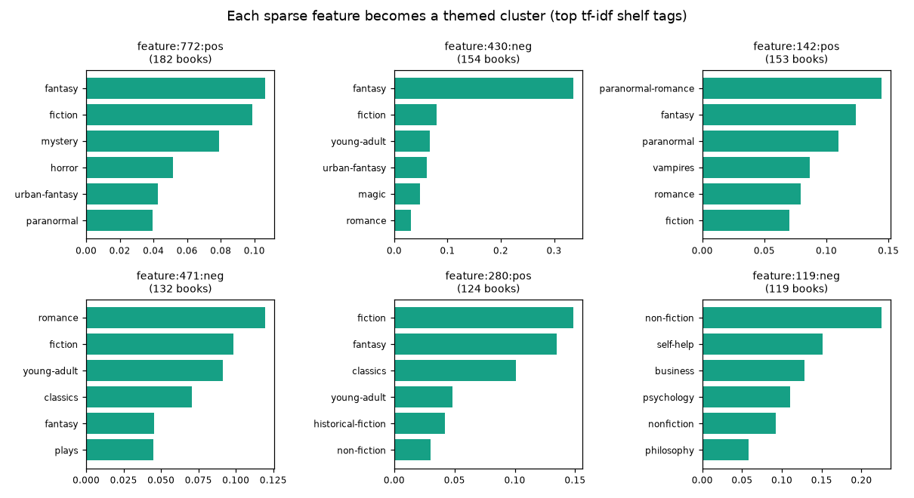
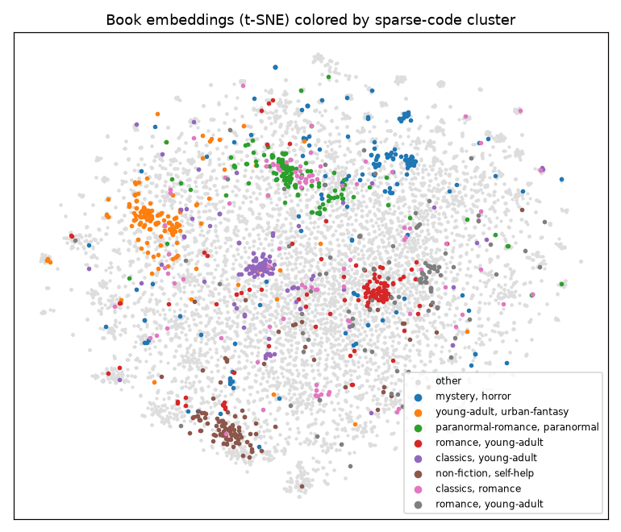
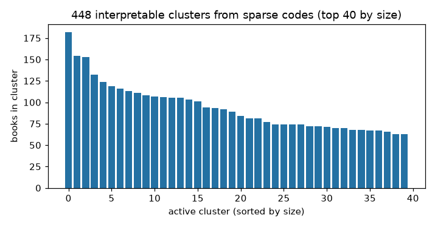

Clustering Sparse Codes
=======================

Sparse codes are not just smaller — they are *organized*. Each row is a short
list of signed features, and rows that share features tend to be semantically
related. ``compresso.clustering`` turns that structure into an interpretable
hierarchy of clusters.

This page is a hands-on walkthrough on a real dataset: the
`Goodbooks-10k <https://github.com/zygmuntz/goodbooks-10k>`_ collection of
10,000 books. We embed each book's text, compress the embeddings into sparse
codes, and cluster the codes into book "themes" — then label those themes with
Goodreads shelf tags. All figures on this page come from ``docs/gen_figures.py``.

The idea
--------

A standard clustering algorithm (k-means, agglomerative) works on *dense*
vectors and asks "which points are close?". Compresso's clustering instead works
on *sparse activation patterns* and asks "which entities switch on the same
features?". Because a top-k SAE feature usually corresponds to one concept, a
group of entities sharing a feature is a ready-made, explainable cluster — no
distance threshold to tune for the first cut, and the cluster comes with the
feature(s) that define it.

Step 1 — from text to sparse codes
----------------------------------

We start from dense text embeddings (any sentence encoder works) and compress
them with a top-k SAE exactly as in :doc:`getting-started`:

.. code-block:: python

   import numpy as np
   from sentence_transformers import SentenceTransformer
   from compresso import TopKSAEConfig, TopKSAETrainer

   # text = ["<title>. by <authors>. <description>", ...] for 10k books
   encoder = SentenceTransformer("sentence-transformers/all-MiniLM-L6-v2")
   emb = encoder.encode(text, normalize_embeddings=True).astype("float32")  # (10000, 384)

   srp = TopKSAETrainer(
       TopKSAEConfig(hidden_dim=1024, k=32, epochs=80, decay=True, seed=0)
   ).fit_transform(emb)                                                       # (10000, 1024), k=32

(If you persisted codes earlier, ``srp = load_srp_tensor(...)`` — see :doc:`io`.)

Step 2 — build a clustering pipeline
------------------------------------

A :class:`~compresso.clustering.ClusteringPipeline` is an ordered list of steps
applied to the ``SRPTensor``. Each step is a small, named transform, so the
recipe reads top-to-bottom:

.. code-block:: python

   import compresso.clustering as cc

   clusters = cc.ClusteringPipeline([
       cc.TopMSignedClustering(top_m=2, min_cluster_size=10),     # 1. seed clusters
       cc.EntityContainmentLink(threshold=0.9),                   # 2. find nested clusters
       cc.MaterializeLinkMerges(parent_scope="active"),           # 3. merge along those links
       cc.PruneRedundantRoots(),                                  # 4. drop subsumed clusters
       cc.AssignTags(entity_tag_matrix=tags, tag_names=tag_names, # 5. label with shelf tags
                     method="tfidf", top_k=8),
       cc.SizeFilter(min_cluster_size=15),                        # 6. keep sizeable clusters
   ]).fit(srp)

What each stage does:

1. **Clustering** (``TopMSignedClustering``) seeds clusters from activation
   patterns: entities are grouped by their top-``m`` *signed* features, so a
   feature firing positively and negatively yields two distinct groups. Other
   seed strategies are available (``DominantSignedClustering``,
   ``ComboSignedClustering``, ``SRPSimilarityClustering``).
2. **Linking** (``EntityContainmentLink``) records when one cluster's members
   are (almost) a subset of another's, without merging yet.
3. **Materializing** (``MaterializeLinkMerges``) turns those links into actual
   parent clusters, building a hierarchy.
4. **Pruning** (``PruneRedundantRoots``) deactivates clusters that are fully
   contained in a larger active one, so the active frontier is clean.
5. **Tagging** (``AssignTags``) aggregates an entity-tag matrix over each
   cluster's members and stores the top tags, ``"tfidf"`` down-weighting
   globally common tags.
6. **Filtering** (``SizeFilter``) keeps only clusters above a size — note this
   changes the *active* set; every cluster is still inspectable via
   ``clusters.clusters``.

``fit`` returns a :class:`~compresso.clustering.SparseClusterSet`. Filtered and
merged-away clusters remain in the graph; the ones that matter are the active
frontier, ``clusters.active_clusters``.

Step 3 — the entity-tag matrix (optional labels)
------------------------------------------------

``AssignTags`` is what makes the clusters self-describing. It takes a
``(n_entities, n_tags)`` matrix (dense or SciPy sparse) of tag counts/weights and
the column names. For Goodbooks we build it from the Goodreads shelf tags
(``fantasy``, ``self-help``, ...); any per-entity label source works — genres,
categories, keyword flags. Tags are stored on each cluster as ``ScoredTag``
objects with ``name``, ``score``, and ``count``.

For LLM- or rule-based free-text labels, ``LabelClusters`` runs a user-supplied
callback over the clusters; Compresso coordinates the loop but you own the model
and prompt.

What you get
------------

On Goodbooks this yields a few hundred active clusters. Each one corresponds to
a sparse feature and lines up with a recognizable book theme — from contemporary
romance to self-help to religion:

.. code-block:: text

   feature:471:neg  n=132  tags=[romance, fiction, young-adult, classics]
                    e.g. Twilight; Romeo and Juliet; The Notebook
   feature:119:neg  n=119  tags=[non-fiction, self-help, business, psychology]
                    e.g. How to Win Friends and Influence People; The Purpose Driven Life
   feature:176:neg  n=113  tags=[fiction, romance, young-adult, contemporary]
                    e.g. Me Before You; Never Let Me Go; P.S. I Love You
   feature:258:pos  n=108  tags=[christian, non-fiction, religion, fiction]
                    e.g. The Shack; A Prayer for Owen Meany; The God Delusion

The largest themes and their defining shelf tags:

Crucially, these clusters were found from the *sparse codes alone*. Projecting
the original dense embeddings to 2D and coloring by cluster shows the sparse
groups land on coherent regions of the embedding space — the compression kept
the semantics:

Inspecting clusters
-------------------

A :class:`~compresso.clustering.SparseClusterSet` is easy to walk:

.. code-block:: python

   for c in sorted(clusters.active_clusters, key=lambda c: -c.entity_count)[:10]:
       tags = ", ".join(f"{t.name}:{t.score:.2f}" for t in c.tags[:5])
       members = titles[c.entity_indices[:5]]          # your own metadata table
       print(c.cluster_id, c.entity_count, "|", tags)
       print("  ", "; ".join(members))

       # the feature(s) that define the cluster:
       print("  centroid features:", c.centroid.indices.tolist())

which prints the largest themes, the books in them, and the sparse feature each
one is built on:

.. code-block:: text

   feature:772:pos 182 | fantasy:0.11, fiction:0.10, mystery:0.08, horror:0.05, urban-fantasy:0.04
      World War Z: An Oral History of the Zombie War; Pet Sematary; The Graveyard Book; Speaker for the Dead (Ender's Saga, #2); The Walking Dead, Vol. 01
     centroid features: [772]
   feature:430:neg 154 | fantasy:0.34, fiction:0.08, young-adult:0.07, urban-fantasy:0.06, magic:0.05
      The Night Circus; Ella Enchanted; The Magician's Nephew (Chronicles of Narnia, #6); The Color of Magic (Discworld, #1); The Velveteen Rabbit
     centroid features: [430]
   feature:142:pos 153 | paranormal-romance:0.14, fantasy:0.12, paranormal:0.11, vampires:0.09, romance:0.08
      Dark Places; Sharp Objects; Heart of Darkness; The Subtle Knife (His Dark Materials, #2); Dark Lover (Black Dagger Brotherhood, #1)
     centroid features: [142]

Each cluster is defined by a single sparse feature (``centroid features``), and
its members and shelf tags agree — a self-explaining group, not an opaque
cluster id.

Useful members:

* ``clusters.active_clusters`` — the current frontier (after pruning/filtering).
* ``clusters.clusters`` — every cluster, including merged/filtered nodes.
* ``clusters.cluster_by_id[cid]`` — look up one cluster.
* ``cluster.entity_indices`` / ``entity_count`` — row indices and size.
* ``cluster.centroid`` — the defining sparse feature vector (``indices``/``values``).
* ``cluster.tags`` / ``cluster.label`` — assigned tags and optional text label.
* ``cluster.parent_cluster_ids`` / ``child_cluster_ids`` — hierarchy links.

Saving cluster graphs
---------------------

Cluster graphs round-trip to disk, so you can compute once and explore later:

.. code-block:: python

   from compresso.clustering import save_cluster_graph, load_cluster_graph

   save_cluster_graph(clusters, "clusters.json")
   clusters = load_cluster_graph("clusters.json")

   # or as plain dicts for custom storage:
   from compresso.clustering import graph_to_dict, graph_from_dict
   payload = graph_to_dict(clusters)

Other building blocks
---------------------

The pipeline steps are mix-and-match. Besides the seeds and links above, merges
include ``EntityIoUMerge`` (Jaccard overlap of members),
``CentroidSimilarityMerge``, ``EntityContainmentMerge``, and
``SemanticSimilarityMerge``; ``AssignUnclusteredToNearestCluster`` sweeps up
leftovers. A lower-level functional API (``cc.cluster_srp(...)`` and
``cc.run_clustering_pipeline(...)``) exists for one-call experiments, but the
class-based ``ClusteringPipeline`` shown here is the recommended surface.

.. note::

   The clustering API is the most actively developed part of Compresso. The
   pipeline-and-graph-types surface documented here is the intended entry point;
   the lower-level builder/merge functions may change.
