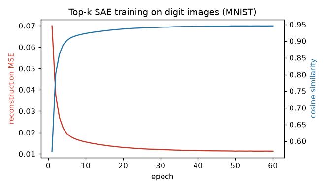

Getting Started
===============

This page explains the ideas behind Compresso from the ground up, then walks
through a first end-to-end run. If you just want a snippet to copy, jump to
:ref:`first-run`; if you want to *see* what a sparse autoencoder learns, read
the :doc:`basic-example` next.

Why sparse representations?
---------------------------

Most modern models hand you **dense** embeddings: a 384- or 4096-dimensional
vector where every coordinate is non-zero and no single coordinate means
anything on its own. Dense vectors are great for similarity search but awkward
for *interpretation*, *storage*, and *clustering* — every dimension is
entangled with every other.

A **sparse** representation rewrites each vector as a short list of
``(feature, value)`` pairs: only a handful of coordinates are active, and each
active coordinate tends to stand for one human-meaningful concept. Compresso
turns dense embeddings into fixed-size sparse codes and gives you tools to
store, reload, and cluster them.

The top-k sparse autoencoder
----------------------------

The workhorse is a **top-k sparse autoencoder (SAE)**. It is a small,
single-hidden-layer autoencoder with one twist: the hidden layer keeps only its
``k`` largest activations per input and zeroes out the rest.

.. code-block:: text

   dense x  ─▶  encoder (Linear)  ─▶  keep top-k  ─▶  sparse code z  ─▶  decoder (Linear)  ─▶  reconstruction x̂
   (D dims)                           (k of H active)                  (D dims)

Training minimizes the reconstruction error between ``x`` and ``x̂``. Because
the bottleneck can only pass ``k`` numbers through, the encoder is pushed to
discover a **dictionary** of reusable features (the decoder's columns) such
that every input can be rebuilt from just ``k`` of them.

Three properties make this useful:

* **Fixed-k sparsity.** Every code has *exactly* ``k`` non-zeros — not "about
  ``k``". Storage and downstream algorithms can rely on a constant budget.
* **Overcompleteness.** The hidden width ``H`` is usually *larger* than the
  input dim ``D``. With more slots than dimensions, individual features
  specialize instead of being forced to share.
* **Interpretability.** Each learned feature usually corresponds to a concept;
  the :doc:`basic-example` and :doc:`clustering-visualization` pages show this concretely.

Key objects
-----------

You can drive everything through one high-level class and one container:

``TopKSAETrainer`` / ``TopKSAEConfig``
    A scikit-learn-style wrapper: ``fit`` trains on a dense matrix, ``transform``
    returns sparse codes, ``fit_transform`` does both. All hyperparameters live
    in the :class:`~compresso.TopKSAEConfig` dataclass.

:class:`~compresso.SRPTensor`
    The sparse output container ("Sparse Representation"). It stores codes as
    ``(rows, k)`` column-index and value tensors with a logical dense shape, and
    converts to dense / SciPy / torch-sparse on demand. See :doc:`io`.

If you need the layers underneath (custom training loops, the straight-through
estimator, sparsity schedules), see :doc:`advanced-usage`.

.. _first-run:

Your first run
--------------

The input is always a 2D dense matrix of shape ``(n_samples, dim)`` — a NumPy
array or a Torch tensor. Here we use random data so the snippet runs anywhere:

.. code-block:: python

   import numpy as np
   from compresso import TopKSAEConfig, TopKSAETrainer

   embeddings = np.random.randn(10_000, 512).astype("float32")

   trainer = TopKSAETrainer(
       TopKSAEConfig(
           hidden_dim=4096,   # H: number of dictionary features (overcomplete)
           k=32,              # active features kept per row
           batch_size=1024,
           epochs=50,
           lr=1e-3,
           decay=True,        # cosine learning-rate decay
       )
   )

   srp = trainer.fit_transform(embeddings)
   print(srp)                 # SRPTensor(shape=(10000, 4096), k=32, ...)
   print(srp.k, srp.nnz)      # 32   320000

``fit_transform`` returns an :class:`~compresso.SRPTensor` with logical shape
``(10_000, 4096)`` holding exactly ``32`` values per row. Non-``float32`` inputs
are converted to the model's dtype before training and encoding.

Fit and transform separately
----------------------------

In practice you often train on one split and encode another (for example, fit
on training items, then encode cold items you never trained on):

.. code-block:: python

   trainer.fit(embeddings[train_idx])         # learn the dictionary
   codes_all = trainer.transform(embeddings)  # encode everything -> SRPTensor

   dense = trainer.reconstruct(embeddings[:8])  # (8, 512) reconstructions
   codes = trainer.encode(embeddings[:8])       # (8, 4096) dense sparse codes

After ``fit``, ``trainer.history`` is a list of per-epoch dicts
(``reconstruction_mse``, ``cosine_loss``, ``active_count``, ``dead_features``,
``lr``) you can plot to monitor training:

What's next
-----------

* :doc:`basic-example` — train an SAE on images and *see* the learned features.
* :doc:`io` — the input contract and the :class:`~compresso.SRPTensor` format in
  full: conversions, saving, and reloading in another project.
* :doc:`advanced-usage` — drop below the trainer to the raw modules.
* :doc:`clustering-visualization` — turn sparse codes into interpretable clusters on a real
  recommender dataset.
